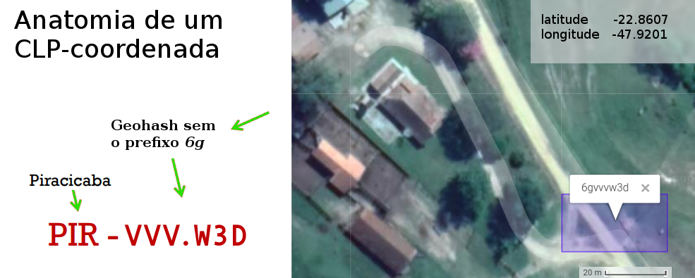
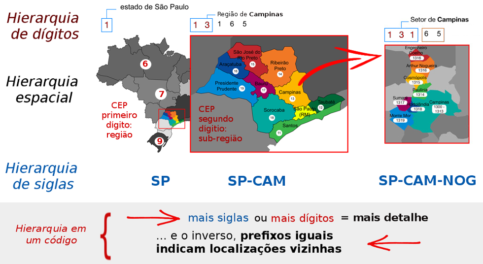
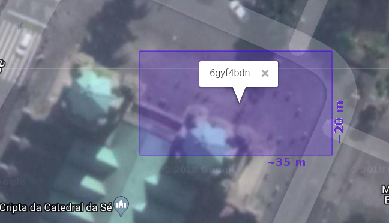
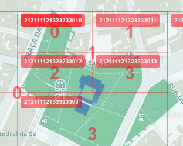
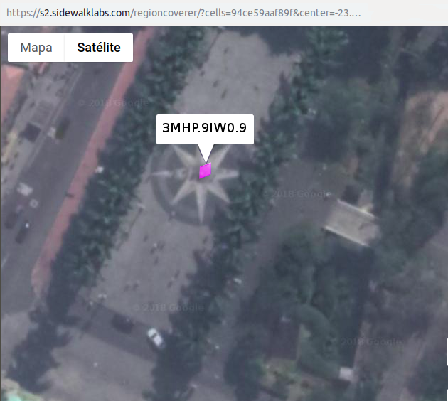
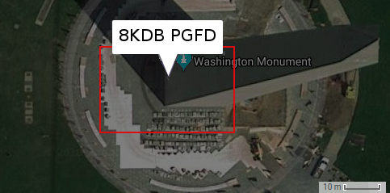
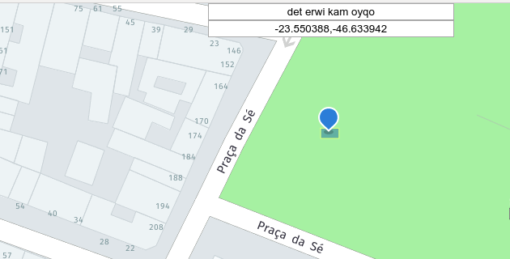

**
<big>CLP baseado na coordenada</big>
**

As coordenadas geográficas e a sua representação em padrões abertos não dependem de qualquer infraestrutura e, portanto, não dependem de empresas ou do governo para a  sua existência e uso continuado. O padrão básico se chama [**Geo URI**](https://en.wikipedia.org/wiki/Geo_URI_scheme) e vem sendo usado em links da internet ([exemplo](geo:37.786971,-122.399677)), na troca de dados (ex. vCard), na telefonia móvel (GeoSMS), no Android, e uma infinidade de outras.

A proposta de um [Código Localizador de Portão](index.md) baseado em coordenada (**CLP-coordenada**) consiste, a grosso modo, em representar de maneira hierárquica e compacta as coordenadas. Com uma hierarquia que começa na escala do estado, com duas letras, depois o município, representado por uma [sigla de 3 letras](spec04ap01-siglas.md), até chegar no portão, cuja localização seria representada  por um código do tipo Geohash &mdash; ou outro qualquer que venhamos a eleger no presente projeto.

As coordenadas geográficas são muito longas. [No exemplo](https://www.openstreetmap.org/?mlat=-22.860799&mlon=-47.920199&zoom=18), se ficarmos só nos dígitos **seriam ao todo 12**, os dígitos "228607" da latitude e "479201" da longitude. Difícil decorar e trabalhoso digitar.

O primeiro passo é transformar esses 12 elementos em 8, ao traduzirmos as coordenadas para Geohash, [`6GVVVW3D`](http://geohash.org/6gvvvw3d).

O segundo passo, para compactar mais um pouco, é fazer uso do contexto: se já sabemos que estamos localizados em `SP` e a sigla `PIR` já diz que é Piracicaba, então o Geohash não precisa dizer que estamos no hemisfério sul, etc. dispensamos o prefixo `6G` do Geohash, comum a todos os pontos de Piracicaba. **Sobram 6** caracteres: o código `PIR-VVV.W3D` é mais "palatável" para memorizar ou digitar.

## Sintaxe

O código CLP é uma sequência de letras (A-Z) e números (0-9), com grupos separados por hífen ("-"). Essa sequência tem um prefixo e um sufixo, conforme a seguinte regra sintática, onde o prefixo é um código de jurisdição e o sufixo do CLP-coordenada um códido de coordenada gegráfica válido para o interior do territorio da jurisdição:

Por ser um padrão restrito ao território brasileiro inicia pela sigla `BR`.  As jurisdições `"BR-" <uf>`, referentes às unidades da federação, são determinadas pelo padrão [ISO&nbsp;3166-2:BR](https://pt.wikipedia.org/wiki/ISO_3166-2:BR), ou seja, são as tradicionais siglas de estado padronizadas pelo IBGE. Em seguida a última parte do código de jurisdição é o Município.

Como há a opção de usar o CLP para designar porções maiores e menores da hierarquia territorial, a UF e o Município são opcionais:

A designação de município faz uso das [**siglas de 3 letras**](spec04ap01-siglas.md) do padrão já em uso nos identificadores de estradas. Como o CLP é **sensível a contexto** de país e UF, o uso do prefixo `BR` é dispensável no "contexto Brasil" e o uso da UF também dispensável quando as partes usuárias do CLP forem capazes de deduzir com certeza a UF.

## Comparando com outros padrões

Existe uma imensa diversidade de representações alternativas à Latitude/Longitude, e que podem ser consideradas também "geocódigos". Pode-se classificá-las da seguinte forma:

* representação baseada em [grade global discreta](https://en.wikipedia.org/wiki/Discrete_Global_Grid) (do inglês DGG - *Discrete Global Grid*), que reduz as infinitas possíveis coordenadas a um número finito de células definidas por uma grade global. As DGGs podem ainda ser classificadas por seu nível de resolução &mdash; supor como "alta resolução" a DGG que oferece células de 3x3 metros ou menores &mdash;,  e pelo uso ou não da hierarquia:

     * DGG hierárquica: que oferece a possibilidade de subdividir células da grade através de uma nova grade no seu interior. A [grade do Geohash](http://www.bigfastblog.com/geohash-intro) é um exemplo.

     * DGG não-hierárquica: uma só grade, sem subgrades. Pode ser uma grade grosseira, como os 60 [*fusos de UTM*](https://en.wikipedia.org/wiki/Universal_Transverse_Mercator_coordinate_system#UTM_zone), ou detalhada, como o [MGRS](https://en.wikipedia.org/wiki/Military_Grid_Reference_System) de uso militar.    

* representação sem DGG.  Os [códigos de país](https://en.wikipedia.org/wiki/Country_code) por exemplo (entre eles a ISO&nbsp;3166&#8209;1&nbsp;alpha&#8209;2 que adotamos como prefixo no CLP), pois a sua cobertura sobre o globo é incompleta (os oceanos não são países). Neste grupo também se encontram os [códigos postais](https://en.wikipedia.org/wiki/Postal_code).  

Um levantamento parcial foi realizado por [K. Clemens em 2016](https://www.thinkmind.org/download.php?articleid=geoprocessing_2016_7_10_30119), ao analisar as características de geocódigos e de códigos postais em geral. A principal vantagem de um geocódigo baseado em DGG de alta resolução, sobre um código postal comum, é que a capacidade de localizar o ponto desejado.

O CEP `20031-050` do endereço de entrada do Teatro Municipal do Rio,<!-- Rua Evaristo da Veiga, 1; ... O CEP `20031-040` da refere-se a uma praça inteira, a Floriano &dash;  que pode também ser referenciada pelo [PlusCode `3RRF`](https://plus.codes/589R3RRF+) ou Geohash `CM9MX`. --> não nos diz onde está, informa apenas que é a rua&nbsp;Evaristo da Veiga.<!-- ](https://www.openstreetmap.org/way/50485413)--> Um código localizador, como por exemplo  [PlusCode **`3RRF+6F`**](https://plus.codes/589R3RRF+6F), diz exatamente onde está o  portão!<!-- O **CEP `69010-060`** de uma casa em Manaus não nos diz onde ela está, mas o **[PlusCode `VXCG+3R4`](https://plus.codes/678XVXCG+3R4)** diz exatamente onde está o seu portão!-->

## Aprendizados com o CEP

Depois de décadas usando o CEP aprendendos que [ele tem problemas](https://github.com/OSMBrasil/CRP/blob/master/substituir-CEP.md) intríncecos do código, e problemas de operação, do "Sistema CEP" como um todo, por reter patentes e direitos autorais, ser centralizado, etc. Sabemos que precisamos do oposto,  **queremos códigos livres** e descentralizados.

Quanto aos problemas intrínsecos, o principal é a dificuldade de se memorizar. O CEP é tão pouco **mnemônico** (pouco amigável para memorização) quanto um número de telefone. O uso de siglas já padronizadas, que já estão em nossa memória, seria um grande avanço. Podemos melhorar o CEP [substituindo prefixos por siglas](http://www.openstreetmap.com.br/CRP/). O&nbsp;código de um CEP do Amazonas&nbsp;(AM) pode ser `AM150‑088` ao invés de `69150‑088`, de um CEP de Tocantins&nbsp;(TO), `TO500‑360` ao invés de `77500‑360`.

Também aprendemos com o uso do CEP que um código com hierarquia é útil. Se formos substituir o CEP por um novo padrão, o CLP, queremos que ele preserve essa característica de ser um código hierárquico.

A hierarquia garante que dois CEPs, digamos `13165` e `13170`, se possuem prefixos iguais, então são vizinhos, estão dentro de uma mesma região, representada pelo prefixo comum, `131` no exemplo.

O CEP com mais dígitos vai representando com mais detalhe uma região do espaço... Mas são 8 dígitos no CEP completo, e ainda assim não representa o endereço exato do portão. **Com o CLP podemos fazer melhor**,

e  justamente por isso, entre outras aplicações, o CLP num futuro distante substituiria  o CEP, para num só código, de 7 ou 8 caracteres, chegarmos no portão.

# Comparando candidatos

Comparação entre padrões abertos mais difundidos e tecnicamente satisfatórios: Geohash, PlusCode e S2. Outras tecnologias podem vir a ser acrescentadas como opção para se eleger o melhor fundamento para o código CLP.

A seguir comparação se deu em torno de um ponto de controle bem conhecido, na capital do Estado de São Paulo, o [Marco Zero](https://pt.wikipedia.org/wiki/Marco_zero_da_cidade_de_S%C3%A3o_Paulo) (*latitude -23.550385, longitude -46.633956*). O pedestal do Marco tem aproximadamente 3 metros de diâmetro, as dimensões usuais de um portão urbano.

Códigos em sua extensão completa, sem cortar prefixo de município, e sem qualquer outra adaptação, tal como a base numérica dos seus dígitos:
* Nactag (base32): ??
* Geohash (base32): `6gyf4bf1n`
* PlusCode normal (base20): `588MC9X8+RC`
* S2 (hexadecimal): `94ce59aaf89`

O uso de códigos híbridos, que misturam a designação do município com a coordenada do ponto, é realizado apenas em duas das tecnologias populares analisadas:

* PlusCode hibrido (cidade+base20): `C9X8+RC São Paulo, Brasil`
* MapCode (cidade+base32): `BR-SP-RR.56`

Ainda assim o PlusCode não oferece resolução de abreviações, e o MapCode trata `BR-SP-SPA` como `SP`, subintendendo que é a capital. Como qualquer uma das tecnologias abertas pode ser livremente adaptada, com a inclusão da sigla de município resultariam nos seguintes códigos:

* Geohash Hibrido: `SPA-YF4B.F1N`
* PlusCode com sigla da cidade: `SPA-C9X8+RC`
<!-- * S2 em base36: `3MHP9.IW09`-->
* S2 em base 36 com prefixo SPA: `SPA-XIW.09`

A seguir cada um dos exemplos será ilustrado pelo mapa fornecido na respectiva infraestrutura.

## Geohash
Localização do Marco-zero representada por Geohash:  [`6gyf4bf1n`](http://geohash.org/6gyf4bf1n).

O link acima aponta para `geohash.org` que não dá zoom compativel com a resolução do Geohash. Para a ilustração abaixo foi utilizada a interface manual de [movable-type.co.uk/scripts/geohash](http://movable-type.co.uk/scripts/geohash.html).

Os dois primeiros dígitos (prefixo `6g`) podem ser cortados quando sabemos que o contexto é a cidade de São Paulo, disso resulta o código mais compacto `YF4B.F1N`. Como demonstrado [na apresentação](index.md#comparacoes-e-como-seria), fazendo uso do conjunto de cobertura (reindexação de `6gyf` para `3`) fica ainda mais compacto (!), `34B.F1N`.

Para completar a ilustração, vejamos a localização de um portão vizinho do Marco, como a *entrada da Catedral da Sé*, com sua escadaria de ~10m

* Geohash (base32), 9 dígitos: `6gyf4bdn9` (SPA-34B.DN9)  precisão ~5x5m
* Geohash (base32), 8 dígitos: `6gyf4bdn` (SPA-34B.DN)  precisão ~35x20m

A assimetria das células que ocorre em certos níveis hierárquicos, como o de 8 dígitos ilustrado acima, tem origem  num problema intrínseco do sistema Latitude-longitude, que só seria corrigido mediante projeção (por exemplo projeção cônica resultaria em coordenadas UTM). Com origem na mesma causa, há também o problema das células Geohash perderem precisão com a latitude &mdash; crescendo a área da célula conforme nos aproximamos do Equador, ao norte do país. A área das células de 8 dígitos varia de 25,1±0,2 m² no RS; até 26,9±0,1 m² no AM. Nas células de 9 dígitos a variação é de 4,4 m² a 4,8 m².

Por fim, apesar de ser um sistema inteligente na sua hierarquia, matematicamente ele se baseia num fractal que "dá saltos", a [*curva de ordem Z*](https://en.wikipedia.org/wiki/Z-order_curve), perdendo-se a propriedade de "células vizinhas com prefixos iguais", que o tornou atrativo. No [Geohash-Hilbert](https://github.com/tammoippen/geohash-hilbert) o problema foi corrigido, assim como no [S2](#s2) descrito a seguir.

Quanto aos níveis indermediários da hierarquia, é possível expandir o código Geohash para base4, conforme [ilustração abaixo do prefix-tree](http://mapzen.github.io/leaflet-spatial-prefix-tree/).<!-- ou https://github.com/missinglink/leaflet-spatial-prefix-tree --> Através desses níveis intermediários, códigos ligeiramente mais curtos podem ser conseguidos, fazendo uso de um mosaico mais detalhado na [cobertura dos municípios](index.md#cobertura).

**Resumo das características do Geohash:**
<table border="1" width="95%">
<tr>
  <td width="180"><i>Representação numérica</i>:  <b>base32</b></td>
  <td width="155"><i>Célula títipica</i>:  <b>9 dígitos ~5×5 m</b></td>
  <td><i>Hierarquia</i>:  <b>sim</b>, podendo ser melhor adaptada</td>
</tr>
<tr>
  <td colspan="2"><i>Algoritmos de referência</i>:
     - <a href="https://github.com/kungfoo/geohash-java">código Java</a> (licença <a href="https://github.com/kungfoo/geohash-java/blob/master/LICENSE">Apache2</a>);
     - <a href="https://postgis.net/docs/ST_GeoHash.html">ST_GeoHash()</a> do PostGIS (licença <a href="https://opensource.org/licenses/gpl-2.0.php">GPL2</a>).
  </td>
  <td><i>Potencial de adaptação</i>: 
    <b>médio</b>, pode-se mudar o alfabeto da base, e acomodar o uso de prefixo de município.
  </td>
</tr>
<tr>
  <td colspan="3"><i>Infraestrutura de teste utilizada</i>:
   Geohash nativo do PostGIS. Visualização com LeafletJS e sua biblioteca [GeoJSON](https://leafletjs.com/examples/geojson/), e [boxes Geohash-JS](https://codepen.io/jthomassie/pen/lvoGe).
  </td>
</tr>
</table>  

## PlusCode

Localização do Marco-zero representada por PlusCode: [`588MC9X8+RC`](https://plus.codes/588MC9X8+RC), com célula de ~10×10m. A definição do código se encontra em [OLC Definition](https://github.com/google/open-location-code/blob/master/docs/olc_definition.adoc). Há uma sutil distinção entre o algoritmo OLC, opção em foco no presente estudo, e a [API Google denominada *PlusCodes*](https://github.com/google/open-location-code/wiki/Plus-codes-API), já na sua versão 2.0 desde outubro de 2018.<!-- prova em  https://web.archive.org/web/20181017144813/https://github.com/google/open-location-code/wiki/Plus-codes-API  -->

Os quatro primeiros dígitos (prefixo `588M`) podem ser cortados quando sabemos que o contexto é a cidade de São Paulo, disso resulta o código mais compacto `C9X8+RC`.

Grade principal **sem hierarquia**: com células de 1/8000° esferoradianos (áreas de ~100 m²), nesta grade o endereço vizinho do Marco-zero (Editora UNESP a menos de 100 m do Marco-zero) apresenta código [F928+27](https://plus.codes/588MF928+27), totalmete distinto.

Para variações na precisão do endereço, existe a hierarquia da grade secundária, subdividindo em mais 20×20 células, com a adição de mais dois dígitos depois do sinal "+". Desse modo [`C9X8+RC4`](https://plus.codes/588MC9X8+RC4) é uma célula com ~2,5 metros de lado, e [`C9X8+R`](https://plus.codes/588MC9X8+R) ~200 metros.  Devido ao "salto", sem possibilidade de precisão intermediária, o PlusCode deixa de contemplar a escala do portão rural, da ordem de 15×15m nos requisitos do CLP.

**Resumo das características do PlusCode:**
<table border="1" width="95%">
<tr>
  <td width="180"><i>Representação numérica</i>:  <b>base20</b></td>
  <td width="155"><i>Célula títipica</i>:  <b>10 dígitos ~10×10 m</b></td>
  <td><i>Hierarquia</i>:  <b>não</b>, subgrade de 3 níveis insuficiente</td>
</tr>
<tr>
  <td colspan="2"><i>Algoritmo de referência</i>:
      <a href="https://github.com/google/open-location-code/blob/master/python/openlocationcode.py">código Python</a> e outros, todos <b>licença <a href="https://github.com/google/open-location-code/blob/master/LICENSE">Apache2</a></b>
  </td>
  <td><i>Potencial de adaptação</i>: 
    <b>baixo</b>, pode-se mudar a base para 32,  e acomodar o uso de prefixo de município.
  </td>
</tr>
<tr>
  <td colspan="3"><i>Infraestrutura de teste utilizada</i>:
   Código Python do algortimo de referência, adaptado para a base32 do CLP e para o PostGIS.
  </td>  
</tr>
</table>  

## S2

Localização do Marco-zero representada por tecnologia S2: [`94ce59aaf89f`](https://s2.sidewalklabs.com/regioncoverer/?cells=94ce59aaf89f&center=-23.550385%2C-46.633956&zoom=21), com célula de ~2×2m.  A representação pode ser adequada para base32, `3MHP.9IW0.9` (9 dígitos).

O sistema de referência conhecido como "S2 Geometry" é na verdade uma biblioteca para indexação espacial em grandes bancos de dados, descrita em [S2geometry.io](http://s2geometry.io). As células da [grade hierárquia](https://en.wikipedia.org/wiki/Discrete_Global_Grid#Hierarchical_grids), com identificadores de 64 bits (S2geometry/Cell_ID) são em geral expressos fora da base de dados como números hexadecimais, mas essa escolha é indiferente.

O site com recursos para demonstração, utilizado na ilustração abaixo, não faz parte da "distribuição oficial".  

O S2 pode ser considerado uma evolução do [Geohash](#geohash), pois resolve dois problemas sérios para um país de escala continental como o Brasil:

* [Substituí a descontínua *curva de ordem Z*](https://en.wikipedia.org/wiki/Z-order_curve), pela bem comportada [*curva de Hilbert*](https://en.wikipedia.org/wiki/Hilbert_curve), garantindo que códigos vizinhos tenham de fato, em 100% dos casos, o mesmo prefixo, sem descontinuidades.

* Devido ao uso da projeção corretiva (similar a uma projeção UTM), resolve dois problemas:

    * o problema área das células, garantindo que seja uniforme (quase constante) ao longo de todo o território nacional.

    * o problema da forma das células, que se matém uniforme em todas as escalas e ao longo de todo o território nacional.

A implementação de referência da biblioteca S2 é escrita em C++ (mesma linguagem que o PostGIS) e portada para Go, Java e Python. Conforme anunciado, a biblioteca existe desde ~2011 quando uma versão inicial do código foi posta a público, mas somente em  [dezembro de 2017](https://web.archive.org/web/20171205230426/https://opensource.googleblog.com/2017/12/announcing-s2-library-geometry-on-sphere.html) o código passou a ser atualizado e distribuído de de forma mais ampla e confiável.

**Resumo das características do S2geometry/Cell_ID:**
<table border="1" width="95%">
<tr>
  <td width="180"><i>Representação numérica</i>:  <b>base16</b></td>
  <td width="180">
    <i>Célula títipica</i>: <a href="http://s2geometry.io/resources/s2cell_statistics.html">level-21</a>  <b>12 dígitos ~2×2 m</b>
  </td>
  <td><i>Hierarquia</i>:  <b>sim</b>, podendo ser melhor adaptada</td>
</tr>
<tr>
  <td colspan="2"><i>Algoritmo de referência</i>:
      <a href="https://github.com/google/s2geometry">código C++</a> (licença <a href="https://github.com/google/s2geometry/blob/master/LICENSE">Apache2</a>).
  </td>
  <td><i>Potencial de adaptação</i>: 
    <b>bom</b>, pode-se adotar base32 e acomodar o uso de prefixo de município.
    Forma e área das células estável em todo o território nacional.
  </td>
</tr>
<tr>
  <td colspan="3"><i>Infraestrutura de teste utilizada</i>:
   Wraper da versão S2geometry Python adaptado para PostGIS,
  https://github.com/AfieldTrails/s2-postgis
  </td>  
</tr>
</table>  

# Comparando com não-candidatos

Alguns algoritmos/tecnologias são muito ruins e por isso devem ser descartados do estudo comparativo. Um desses algoritmos foi apelidado de *algoritmo ingênuo* e, apesar de não ser candidato, é uma referência importante, estabelecendo o critério de "mínima performance". Ou seja, nenhum "algoritmo candidato a CLP-coordenada" pode ser pior do que o ingênuo.

Outras tecnologias são até muito boas, mas já foram de ante-mão barradas por não serem livres: são restritas por patentes ou direitos autorais. O Whats3words por exemplo é um destes casos.

## Nactag e código Microsoft
A *NACtag* não apresenta vantagens técnicas mas é interessante por ser um dos primeiros geocódigos, e por estabelecer direitos autorais sobre algo que até então não se cogitava como passível de tais direitos. A disputa com a Microsoft também ajuda a realçar os **riscos** envolvidos na adoção de geocódigos não-livres.

Na ilustração a localização do [Monumento a Washington nos EUA](https://www.wikidata.org/wiki/Q178114), nas coordenadas `geo:38.88944,-77.03528`, com célula *NACtag* de ~40×30m. É um código opcionalmente hierarquico de 8 dígitos base36 (4 cada coordenada).

Na Wikipedia a *NACtag* foi registrada como [Natural Area Code (NAC)](https://en.wikipedia.org/wiki/Natural_Area_Code), site oficial [nacgeo.com](http://www.nacgeo.com/nacsite/).

O algoritmo aliado à utilização pública foi proposto em 1994 por Xinhang Shen, visando a representação mais compacta das coordenadas de latitude e longitude, e entendendo que isso demandaria fixar algumas convenções de interpretação, portanto o estabelecimento de um padrão. Shen optou pela via do licenceamento: ainda hoje (com ultima atualização de 2014) a [licença Nactag](http://www.nacgeo.com/nacsite/licensing/NAC_Free_Licensing_Agreement.pdf) não é totalmente livre, apreser de se auto-denominar "free licensing".

A NACtag (ou *NAC locator*) foi também um dos primeiros sistemas de geocódigo a se declarar como [substituto de *postcodes* tradicionais como o CEP](http://globalpostalcodesystem.info/),
já oferecendo a [solução online pelo menos desde 2007](https://web.archive.org/web/20070222110607/http://globalpostalcodesystem.info:80/).

NOTA SOBRE DISPUTA POR DIREITOS AUTORIAIS</a>

Em 2005 entraram em disputa os detentores de direitos  sobre  a patente  internacional No. WO9607170 (de 1995), entitulada *"Compact text encoding of latitude/longitude coordinates"*, de propriedade da Microsoft, e os priprietários da NAC. A patente da Microsoft é de fato  bastante similar e posterior ao registrio de copyright da NACtag, de 1994. Por serem sistemas jurídicos distintos (direitos autorais *vs* direitos sobre patente), o problema permanece.

A patente da Microsoft emprega o algoritmo equivalente para converter as coordenadas de longitude e latitude em inteiros não negativos e, em seguida, usa um conjunto de caracteres com exatamente o mesmo número de caracteres e as mesmas ordens de caracteres, exceto a remoção da letra "L" e a adição da letra "Y". Por exemplo, `longitude -127.8202; latitude 3,436086111` terá as seguintes representações:

* Código NacTag: `4BFGJ HK5DC`
* Código da Microsoft: `hk5dc4bfgj` onde se percebe o grupo `4bfgj` e o grupo `hk5dc`, identicos à representação NACtag.

O caso destaca que, mesmo com a [flagrante ilegalidade da patente Microsoft já demonstrada em 2012](https://web.archive.org/web/20101228091709/http://www.gps-practice-and-fun.com/nacgeo.html#Microsoft), o embrólio jurídico surge como barreira e risco aos protocolos e variantes de geocódigos *sub júdice*. Neste sentido recomenda-se optar por  geocódigos livres e que mais se distanciam de patentes consolidadas.

## MapCode

Localização do Marco-zero representada por tecnologia MapCode: [`BR-SP RR.56`](http://www.mapcode.com/getcoords.html?iso3=331&mapcode=RR.56&xx=-46.633956&yy=-23.550385) com célula de ~5×5m (a confirmar). É um código não-hierarquico (a confirmar) de 4 caracteres aparentemente base36.

O MapCode está contextualizado pela cidade mais populosa nas proximidades do sinal de quem faz a solicitação, que neste caso é a capital de `BR-SP`, representada no link pelo  código *ISO 331*.

Mais detalhes sobre o MapCode no seu [documento de apresentação](www.mapcode.com/mapcode_documentation.doc) e na sua patente.  Foi aparentemente um dos primeiros padrões populares a [sugerirem a substituição do CEP pelo geocode](http://www.mapcode.com/aboutmc.html).

## Whats3words

Localização do Marco-zero representada por tecnologia Whats3words: [`funil.leites.chaves`](https://map.what3words.com/funil.leites.chaves)
com célula de ~4×4m (a confirmar). É um código não-hierarquico de 3 palavras, cada palavra representa um dígito da base600 ou maior.

É o principal representante da priorização do "legível e mnemônico", ou seja, pretende-se que seja mais fácil comunicar, soletrar ou lembrar de uma sequência de 3 palavras aleatórias, do que de uma sequência de 6 letras aleatórias.

## Syllagloble

Localização do Marco-zero representada por tecnologia Syllagloble: [`det erwi kam oyqo`](http://syllagloble.appspot.com)
com célula de ~3×5m (a confirmar).

O *software Syllagloble* é apenas um experimento da empresa "Here". Similar ao What3words, faz uso de 4 sílabas ou palavras curtas, no lugar de 3 palavras longas.

<!--
## Ericode

...

# Outras comparações

## com algoritmo ingênuo

As coordenadas geográficas podem ser [tratadas matematicamente e transformadas em um código mais compacto](spec04ap05-ingenuos.md#compactacao-ingenua), e existem várias maneiras de se fazer isso. Uma delas foi batizada de  Geohash, que é apenas uma das tecnologias candidatas, mas aqui tomaremos como exemplo para ilustrar a anatomia de um CLP-coordenada. Neste projeto serão analisados também o MapCode, o PlusCode e o S2geometry.

## com o CEP

Como uma das metas do CLP é se apresentar como potencial substituto do CEP no endereçamento postal, alguns requisitos, tais como a hierarquia desde macro região (siglas de estado e cidade), são decorrentes desta demanda. As principais diferenças entre o CEP e o CLP são:

Característica | CEP | CLP-coordenada
---------------|-----|------------------
É **um código só** para o usuário lembrar? | sim | sim (um código só)
É mais **fácil de lembrar** do que um número de telefone? | Não. O CEP faz uso de "números opacos", ou seja, não são siglas e não são números com significado que possa ser lembrado. | Talvez. O CLP oferece prefixo mnemônico, baseado nas siglas de estado e município.
Demanda **autoridade central**? | sim | não
Existe **custo** para o uso do sistema crescer? |sim | não
Entidade espacial **representada**: |Região ou logradouro. Na sua hierarquia o CEP representa macro-regiões, tais como um estado inteiro (2 dígitos), depois municípios (5 dígitos), até chegar na escala do logradouro (8 dígitos).!--  Vantagem: uma casa demolida e reconstruída em outro local da rua terá um mesmo CEP.-- |Posição da porta em goordenadas do globo terrestre.  Conforme o número de dígitos representa "células" de uma grade hierárquica, permitindo indicar portões maiores ou menores.
**precisão** no resultado da transformação do código em localização no mapa|Varia conforme seja apenas um "CEP geral da cidde", um CEP de logradouro ou CEP de grande receptor. Em geral nas áreas rurais não existe CEP do logradouro. | Sempre define uma célula de mesma área com opção de acrescentar mais um dígitos para ficar mais preciso. Algumas alternativas permitem mais precisão (menos um dígito) na região da mancha urbana prevista para uma ou mais décadas.

Uma comparação similar foi realizada por K. Clemens em 2016 ([ref](https://www.thinkmind.org/download.php?articleid=geoprocessing_2016_7_10_30119)), ao levandar as características de geocódigos e de códigos postais em geral, de diversos países.
-->
<!---
table align="center" border="0" style="width:75%">
<tr> <td colspan=4 align="center" style="background:#87cefa; color:#000000;"> <b>CÓDIGO POSTAL (tipo CEP)</b>
<tr style="background:#87cefa; color:#000000;" align="center">
   <td colspan=2 align="center" style="background:#ff4500; color:#ffffff;"> Prefixo (geral)
   <td colspan=2 align="center" style="background:#ff4500; color:#ffffff;"> Sufixo (específico)
<tr style="background:#ff4500; color:#000000;" align="center">
   <td> UF (região) <td>Município (distrito) <td> Logradouro <td> Unidade
   <tr style="background:#2222cd; color:#000000;" align="center">
     <td> 699xx AC <td>69901 Acrelândia<td>- <td>-
 <tr style="background:#2222cd; color:#000000;" align="center">
   <td> 699xx AC <td>69901 Capital<td>-000 a -899 vias <td>-9xx condomínios
 <tr style="background:#0000fe; color:#000000;" align="center">
    <td> 65xxx MA<td>65000...65180 São Luiz <td>-000 a -899 vias <td>-9xx condomínios
 <tr style="background:#0000fe; color:#000000;" align="center">
     <td> 65xxx MA<td>65000...65180 São Luiz <td>-000 a -899 vias <td>-9xx condomínios
</table>
-->

-----

# Lietaratura

As comparações entre tecnologias que solucionam o problema também tem sido realizadas, por exemplo 

* "[Addresses and Geocoding: Comparing New & Old Methods](https://www.fulcrumapp.com/blog/comparing-address-and-coordinate-systems/)", 2015.

* "[Comparative Evaluation of Alternative Addressing Schemes](https://www.thinkmind.org/download.php?articleid=geoprocessing_2016_7_10_30119)", 2016.

* "[Location Encoding Systems – Could geographic coordinates be replaced and at what cost?](http://www2.unb.ca/~estef/papers/go_geomatics_stefanakis_march_2016.pdf)",  2016.<!-- demonstra vantagem das silabas e sugere uso de palavras como digito-corretor -->

* [Comparação orientada ao PlusCode](https://github.com/google/open-location-code/wiki/Evaluation-of-Location-Encoding-Systems), ~2015.

Na Irlanda hove um concurso entre 2010 e 2011 para  selecionar propostas sistema de código postal.[[ref](https://web.archive.org/web/20150715224453/http://www.irishtimes.com/news/tender-process-for-postal-codes-launched-1.615952)] Infelizmente na época as soluções abertas não eram tão difundidas e optou-se por um modelo tradicional que supunha alto custo de manutenção, e portanto com demanda por reimbolso através de licenceamento privado.[[ref](https://web.archive.org/web/20091028200100/http://archives.tcm.ie/businesspost/2008/12/07/story38097.asp)],[[ref](https://en.wikipedia.org/wiki/Postal_addresses_in_the_Republic_of_Ireland#Legislation)]
