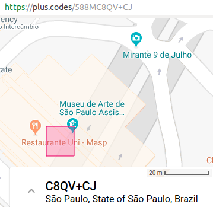
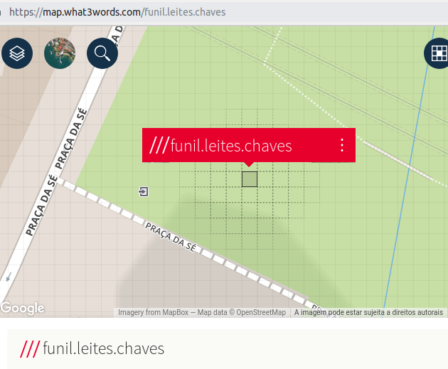

**
<big>CLP baseado na coordenada</big>
**

As coordenadas geográficas e a sua representação em padrões abertos não dependem de qualquer infraestrutura e, portanto, não dependem de empresas ou do governo para a  sua existência e uso continuado. O padrão básico se chama [Geo URI](https://en.wikipedia.org/wiki/Geo_URI_scheme) e vem sendo usado em links da internet ([exemplo](geo:37.786971,-122.399677)), na troca de dados (ex. vCard), na telefonia móvel (GeoSMS), no Android, e numa infinidade de outras tecnologias.

A proposta de um Código Localizador de Portão baseado em coordenada (**CLP-coordenada**) consiste, a grosso modo, em representar de maneira hierárquica e compacta as coordenadas. Com uma hierarquia que começa na escala do município, representado por um código de 3 letras, até chegar no portão, cuja localização seria representada  por um código do tipo Geohash &mdash; ou outro qualquer que venhamos a eleger no presente projeto.

As coordenadas geográficas são muito longas. [No exemplo](https://www.openstreetmap.org/?mlat=-22.860799&mlon=-47.920199&zoom=18), se ficarmos só nos dígitos **seriam ao todo 12**, os dígitos "228607" da latitude e "479201" da longitude. Difícil decorar e trabalhoso digitar.

O primeiro passo é transformar esses 12 elementos em 8, ao traduzirmos as coordenadas para Geohash, [`6GVVVW3D`](http://geohash.org/6gvvvw3d).

O segundo passo, para compactar mais um pouco, é fazer uso do contexto: se já sabemos que estamos localizados em `SP` e a sigla `PIR` já diz que é Piracicaba, então o Geohash não precisa dizer que estamos no hemisfério sul, etc. dispensamos o prefixo `6G` do Geohash, comum a todos os pontos de Piracicaba. **Sobram 6** caracteres: o código `PIR-VVV.W3D` é mais "palatável" para memorizar ou digitar.

-----

# Lietaratura

As comparações entre tecnologias que solucionam o problema também tem sido realizadas, por exemplo 

* "[Addresses and Geocoding: Comparing New & Old Methods](https://www.fulcrumapp.com/blog/comparing-address-and-coordinate-systems/)", 2015.

* "[Comparative Evaluation of Alternative Addressing Schemes](https://www.thinkmind.org/download.php?articleid=geoprocessing_2016_7_10_30119)", 2016.

* "[Location Encoding Systems – Could geographic coordinates be replaced and at what cost?](http://www2.unb.ca/~estef/papers/go_geomatics_stefanakis_march_2016.pdf)",  2016.<!-- demonstra vantagem das silabas e sugere uso de palavras como digito-corretor -->

* [Comparação orientada ao PlusCode](https://github.com/google/open-location-code/wiki/Evaluation-of-Location-Encoding-Systems), ~2015.

Na Irlanda hove um concurso entre 2010 e 2011 para  selecionar propostas sistema de código postal.[[ref](https://web.archive.org/web/20150715224453/http://www.irishtimes.com/news/tender-process-for-postal-codes-launched-1.615952)] Infelizmente na época as soluções abertas não eram tão difundidas e optou-se por um modelo tradicional que supunha alto custo de manutenção, e portanto com demanda por reimbolso através de licenceamento privado.[[ref](https://web.archive.org/web/20091028200100/http://archives.tcm.ie/businesspost/2008/12/07/story38097.asp)],[[ref](https://en.wikipedia.org/wiki/Postal_addresses_in_the_Republic_of_Ireland#Legislation)]

# Comparando com o CEP

Como uma das metas do CLP é se apresentar como potencial substituto do CEP no endereçamento postal, alguns requisitos, tais como a hierarquia desde macro região (siglas de estado e cidade), são decorrentes desta demanda. As principais diferenças entre o CEP e o CLP são:

Característica | CEP | CLP-coordenada
---------------|-----|------------------
É **um código só** para o usuário lembrar? | sim | sim (um código só)
É mais **fácil de lembrar** do que um número de telefone? | Não. O CEP faz uso de "números opacos", ou seja, não são siglas e não são números com significado que possa ser lembrado. | Talvez. O CLP oferece prefixo mnemônico, baseado nas siglas de estado e município.
Demanda **autoridade central**? | sim | não
Existe **custo** para o uso do sistema crescer? |sim | não
Entidade espacial **representada**: |Região ou logradouro. Na sua hierarquia o CEP representa macro-regiões, tais como um estado inteiro (2 dígitos), depois municípios (5 dígitos), até chegar na escala do logradouro (8 dígitos).<!--  Vantagem: uma casa demolida e reconstruída em outro local da rua terá um mesmo CEP.--> |Posição da porta em goordenadas do globo terrestre.  Conforme o número de dígitos representa "células" de uma grade hierárquica, permitindo indicar portões maiores ou menores.
**precisão** no resultado da transformação do código em localização no mapa|Varia conforme seja apenas um "CEP geral da cidde", um CEP de logradouro ou CEP de grande receptor. Em geral nas áreas rurais não existe CEP do logradouro. | Sempre define uma célula de mesma área com opção de acrescentar mais um dígitos para ficar mais preciso. Algumas alternativas permitem mais precisão (menos um dígito) na região da mancha urbana prevista para uma ou mais décadas.

Uma comparação similar foi realizada por K. Clemens em 2016 ([ref](https://www.thinkmind.org/download.php?articleid=geoprocessing_2016_7_10_30119)), ao levandar as características de geocódigos e de códigos postais em geral, de diversos países.
<!---
table align="center" border="0" style="width:75%">
<tr> <td colspan=4 align="center" style="background:#87cefa; color:#000000;"> <b>CÓDIGO POSTAL (tipo CEP)</b>
<tr style="background:#87cefa; color:#000000;" align="center">
   <td colspan=2 align="center" style="background:#ff4500; color:#ffffff;"> Prefixo (geral)
   <td colspan=2 align="center" style="background:#ff4500; color:#ffffff;"> Sufixo (específico)
<tr style="background:#ff4500; color:#000000;" align="center">
   <td> UF (região) <td>Município (distrito) <td> Logradouro <td> Unidade
   <tr style="background:#2222cd; color:#000000;" align="center">
     <td> 699xx AC <td>69901 Acrelândia<td>- <td>-
 <tr style="background:#2222cd; color:#000000;" align="center">
   <td> 699xx AC <td>69901 Capital<td>-000 a -899 vias <td>-9xx condomínios
 <tr style="background:#0000fe; color:#000000;" align="center">
    <td> 65xxx MA<td>65000...65180 São Luiz <td>-000 a -899 vias <td>-9xx condomínios
 <tr style="background:#0000fe; color:#000000;" align="center">
     <td> 65xxx MA<td>65000...65180 São Luiz <td>-000 a -899 vias <td>-9xx condomínios
</table>
-->

# Comparando candidatos

Comparação entre padrões mais populares: Geohash, PlusCode, MapCode. Foi acescentado ainda o padrão S2, que apesar de não ser ainda muito divulgado, é um dos recomendados.

A comparação se deu em torno de um ponto de controle bem conhecido, na capital de SP.

**Códigos do Marco-Zero de SP**

[Marco Zero](https://pt.wikipedia.org/wiki/Marco_zero_da_cidade_de_S%C3%A3o_Paulo) (*latitude -23.550385, longitude -46.633956*) com ~5m de precisão nos padrões mais populares de 2018 e com infraestrutura em operação:

* Geohash (base32): `6gyf4bf1n`
* PlusCode normal (base20): `588MC9X8+RC`
* PlusCode hibrido (cidade+base20): `C9X8+RC São Paulo`
* MapCode (cidade+): `SP-RR.56`
* S2 (hexadecimal): `94ce59aaf89`

Destes, Geohash e S2 ainda não oferecem infraestrutura para sua versão híbrida, e o PlusCode ainda não oferece resolução de abreviações. Resultariam nos seguintes códigos:

* Geohash Hibrido: `SPA-YF4B.F1N`
* PlusCode com sigla da cidade: `SPA-C9X8+RC`
* S2 em base36: `3MHP9.IW09`
* S2 em base 36 com prefixo SPA: `SPA-XIW.09`

A seguir cada um dos exemplos ilustrado pelo mapa fornecido na respectiva infraestrutura pública.

## Geohash
Localização do Marco-zero representada por Geohash:  [`6gyf4bf1n`](http://geohash.org/6gyf4bf1n).

O link acima envia aponta para `geohash.org` que não dá zoom compativel com a resolução do Geohash. Para a ilustração abaixo foi utilizada a interface manual de [movable-type.co.uk/scripts/geohash](https://movable-type.co.uk/scripts/geohash.html).

Os dois primeiros dígitos podem ser cortados quando sabemos que o contexto é a cidade de São Paulo (prefixo `6g`).

Porta principal (~10m), escadaria da igreja da Sé
* Geohash (base32), 9 dígitos: `6gyf4bdn9` precisão ~5x5m
* Geohash (base32), 8 dígitos: `6gyf4bdn` precisão ~35x20m

## PlusCode

Localização do Marco-zero representada por PlusCode: [`588MC9X8+RC`](https://plus.codes/588MC9X8+RC).

## S2

[**S2**](https://s2.sidewalklabs.com/regioncoverer/?cells=94ce59aaf89f&center=-23.550385%2C-46.633956&zoom=20)

# Comparando com não-candidatos
Alguns algoritmos/tecnologias são muito ruins e por isso devem ser descartados do estudo comparativo. Um desses algoritmos foi apelidado de *algoritmo ingênuo* e, apesar de não ser candidato, é uma referência importante, estabelecendo o critério de "miínima performance". Ou seja, nenhum "algoritmo candidato a CLP-coordenada" pode ser pior do que o ingênuo.

Outras tecnologias são até muito boas, mas já foram de ante-mão barradas por não serem livres: são restritas por patentes ou direitos autorais. O Whats3words por exemplo é um destes casos.

## MapCode
[**MapCode**](http://www.mapcode.com/getcoords.html?iso3=331&mapcode=RR.56&xx=-46.633956&yy=-23.550385)

## Whats3words

[**Whats3words**](https://map.what3words.com/funil.leites.chaves)

Por ser patenteado está sendo utilizado apenas como exemplo ilustrativo.

## Syllagloble
[**Syllagloble**](http://syllagloble.appspot.com)

O *software Syllagloble* é apenas um experimento da empresa "Here". Similar ao What3words, faz uso de 4 sílabas ou palavras curtas, no lugar de 3 palavras longas.

## Algoritmo ingênuo

As coordenadas geográficas podem ser [tratadas matematicamente e transformadas em um código mais compacto](spec04ap05-ingenuos.md#compactacao-ingenua), e existem várias maneiras de se fazer isso. Uma delas foi batizada de  Geohash, que é apenas uma das tecnologias candidatas, mas aqui tomaremos como exemplo para ilustrar a anatomia de um CLP-coordenada. Neste projeto serão analisados também o MapCode, o PlusCode e o S2geometry.
